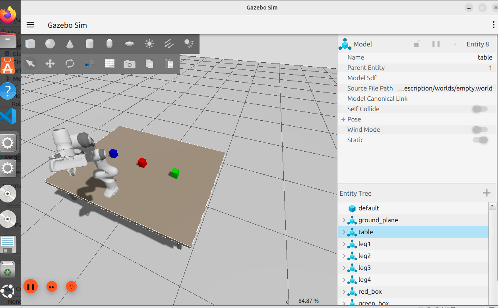
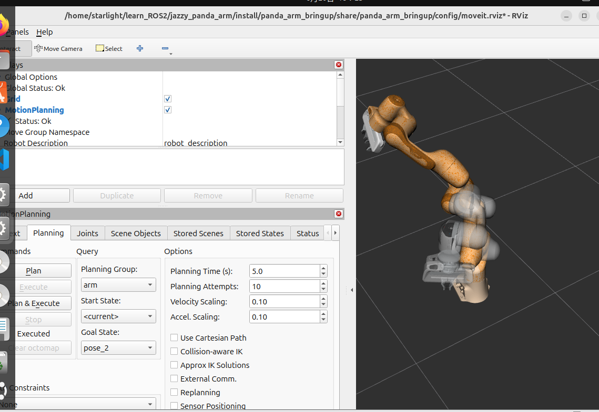

# Panda Arm Simulation in ROS2 Jazzy

## 项目简介

本项目用于在 **ROS2 Jazzy** 环境下对 **Panda Arm** 机械臂进行仿真测试，集成了 **Gazebo** 物理仿真环境和 **RViz2** 可视化工具，为机器人算法开发和验证提供完整的仿真平台。

## 项目特点

- ✅ 基于 ROS2 Jazzy 版本
- ✅ 支持 Gazebo 物理仿真
- ✅ 支持 RViz2 可视化
- ✅ Panda Arm 完整 URDF 模型
- ✅ MoveIt2 运动规划集成

## 系统要求

- **操作系统**: Ubuntu 22.04 或更高版本
- **ROS版本**: ROS2 Jazzy
- **依赖包**:
  - `ros-jazzy-ros-gz-sim`
  - `ros-jazzy-ros-gz-bridge`
  - `ros-jazzy-moveit`
  - `ros-jazzy-robot-state-publisher`
  - `ros-jazzy-xacro`

